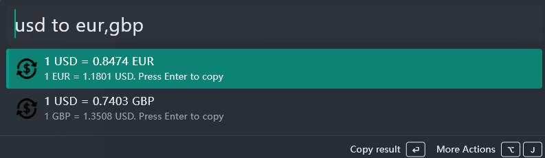
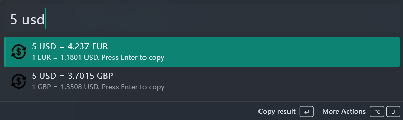

# Currency Converter plugin for Wox launcher
Wox.Plugin.CurrencyConverter is the [Wox 2.0+](https://github.com/Wox-launcher/Wox) plugin to instantly convert one currency to one or multiple others.

Original plugin for old version of wox here https://github.com/ruslanmogilevskiy/Wox.Plugin.CurrencyConverter

It allows you to quickly get the exchange rate of one currency to a single or multiple other currencies:

or quickly convert the specific amount of one currency to a single or multiple favorite currencies that you set in the plugin settings:

## How to install
* Download the Wox.Plugin.CurrencyConverter.wox plugin file from the latest [release](https://github.com/sanioooook/Wox.Plugin.CurrencyConverter/releases).
    * You can compile it manually from sources, it's just a ZIP file with all required files and plugin.json file inside.
* Start dragging this file with the mouse and activate the Wox via shortcut at the same time. Then drop the file to the Wox window and confirm that you want to install the plugin and restart Wox.

## Commands format

One of the following commands must be entered in the WoX's popup dialog:

* &lt;amount&gt; &lt;baseCurrency&gt;  (example: 50 USD)
* &lt;amount&gt; &lt;baseCurrency&gt; to &lt;targetCurrency1&gt;[,targetCurrency2,targetCurrencyN]  (example: 50 USD to EUR,CAD)
* &lt;baseCurrency&gt; to &lt;targetCurrency1&gt;[,targetCurrency2,targetCurrencyN] (example: USD to EUR)

Notice:
* All the entered currencies must be three letter currency codes, like USD or EUR. The codes are case insensitive, i.e. you can enter USD or usd.
* List of target currencies could consist of a single currency or the comma-separated list of currencies. Example: EUR or EUR,CAD,GBP
* The amount value will be parsed as a full-featured float value, with the sign character, thousand separator, decimal characters, etc. Both the current culture's decimal separator and ',' are supported. I.e. all the 10; 10.55 or 10,55; +10.55 or -10.55 are valid amounts.

## Plugin settings

On the plugin settings page you need to enter your currency exchange's API key (described below).

Also, optionally you can specify the list of favorite target currencies that will be used when the target currency wasn't specified in the WoX's query by you.
For example, if the favorite currencies are 'EUR,CAD' then by just entering '10 USD' in the query you'll receive the exchange rate for USD to EUR and CAD currencies. If nothing is specified the 'EUR,USD' value is used, by default.

## Supported currency exchanges

Now, only one currency exchange is supported - [exchangerate-api.com](https://www.exchangerate-api.com) but others could be added quite easy. [Here's](https://www.exchangerate-api.com/docs/supported-currencies) the list of supported currencies.

To make the plugin working for you, you need to register on exchangerate-api.com site, get your personal API key from your profile there and enter it in the plugin's settings API key field. Don't forget to hit the Apply button in the plugin settings window!

Enjoy.
